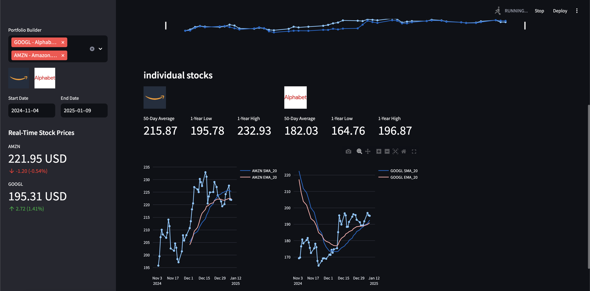

# 📈 Stock Market Analysis and Prediction Project

## 🌟 Overview
This project aims to analyze historical stock market data, predict future stock prices using machine learning models, and perform sentiment analysis on news headlines and social media posts. Additionally, it leverages **Ollama**, a powerful language model, to interpret stock charts based on technical analysis. The insights generated from this project can help investors, traders, and financial analysts make informed decisions.

---

## 🚀 Features
1. **📊 Portfolio Analysis**
   - Build a portfolio by selecting multiple stocks or ETFs.
   - Visualize the performance of the portfolio over time.
   - Track percentage changes, moving averages, and other technical indicators.

2. **📰 Sentiment Analysis**
   - Analyze sentiment from news headlines and social media posts related to selected stocks.
   - Uses a few-shot learning model to classify sentiment as positive, negative, or neutral.

3. **🤖 Technical Analysis with Ollama**
   - Generate stock charts with technical indicators like SMA (Simple Moving Average) and EMA (Exponential Moving Average).
   - Use Ollama (LLaMA 3.2 Vision) to interpret charts and provide actionable insights, such as buy/hold/sell recommendations.

4. **💰 Portfolio Calculator**
   - Simulate investments by allocating amounts to selected stocks.
   - Track the growth of investments over time and set financial goals.

5. **⏰ Real-Time Stock Prices**
   - Display real-time stock prices and percentage changes for selected stocks.

---

## 📖 Table of Contents
1. [Installation](#installation)
2. [Usage](#usage)
3. [Model Training](#model-training)
4. [Output](#example-outputs)

---

## 🛠 installation 

### Prerequisites
- Python 3.8 or higher
- Streamlit for the web interface
- Ollama for technical analysis interpretation
- Required Python libraries (see `requirements.txt`)

### Steps
1. **Clone the Repository:**
   ```bash
   git clone https://github.com/yourusername/stock-market-analysis-prediction.git
   cd stock-market-analysis-prediction

2. Install Dependencies:
   ```bash
   pip install -r requirements.txt
   
3. Set Up Ollama:

   Ensure Ollama is running locally or on a server.

4. Run the Application:
   ```bash
   streamlit run app.py

## Installing and Running Ollama on Your Local Machine
   Step 1: Download and Install Ollama

   Go to the official Ollama page.

Download the Installer:

Download the appropriate installer for your operating system (Windows, macOS, or Linux).

Install Ollama:

Step 2: Run Ollama Locally
Start the Ollama Server:

After installation, start the Ollama server by running the following command in your terminal:
```
ollama run llama3.2-vision
```
This will start the Ollama server on your local machine.

Verify the Installation:

Open a new terminal window and run the following command to verify that Ollama is running:
```
ollama list
```
If the installation is successful, you should see a list of available models.

## 🎯 Usage

### 📊 Portfolio Builder
- Select stocks or ETFs from the dropdown menu.
- View real-time prices and percentage changes for selected stocks.
- Analyze portfolio performance using interactive charts.

### 📰 Sentiment Analysis
- Enter a news headline or fetch news related to selected stocks.
- View sentiment analysis results (positive, negative, or neutral).

### 🤖 Technical Analysis with Ollama
- Generate stock charts with technical indicators (e.g., SMA, EMA).
- Click "Run AI Analysis" to get buy/hold/sell recommendations from Ollama.

### 💰 Portfolio Calculator
- Allocate investment amounts to selected stocks.
- Set a financial goal and track progress over time.

Code Walkthrough
Key Functions
Fetching Stock Data:
```
def fetch_stock_data(ticker, period, interval):
    data = yf.download(ticker, period=period, interval=interval)
    return data
```
Fetches historical stock data using Yahoo Finance (yfinance).

Adding Technical Indicators:
```
def add_technical_indicators(data):
    data['SMA_20'] = ta.trend.sma_indicator(data['Close'], window=20)
    data['EMA_20'] = ta.trend.ema_indicator(data['Close'], window=20)
    return data
```
Adds SMA and EMA to the stock data for technical analysis.

Sentiment Analysis:
```
def get_sentiment_analysis(tickers, start_date, end_date):
    # Fetch news headlines and classify sentiment using a few-shot model
    return sentiment_data
```
Uses a pre-trained few-shot learning model to classify sentiment.

Ollama Integration:
```
def analyze_chart_with_ollama(ticker, chart_data):
    # Generate chart and send to Ollama for analysis
    response = ollama.chat(model='llama3.2-vision', messages=messages)
    return response["message"]["content"]
```
Sends stock charts to Ollama for interpretation and recommendations.

## 🧠 Few-Shot Learning for Sentiment Analysis

### 🌟 Overview
The few-shot learning model is used to classify sentiment from news headlines and social media posts. It is particularly useful when labeled data is scarce, as it can generalize well with only a few examples.

---

## 🛠️ Model Training
The few-shot learning model is trained on a small dataset of labeled news headlines. Here's how the training process works:

### 📂 Prepare the Dataset:
- Collect a small dataset of news headlines labeled as **positive**, **negative**, or **neutral**.

---

## 📊 Example Outputs

1. **📈 Portfolio Performance Chart**  
     
   

2. **💰 Portfolio Calculator**  
   

3. **📰 Sentiment Analysis Table**  
   

4. **🤖 Ollama Analysis**  
   


